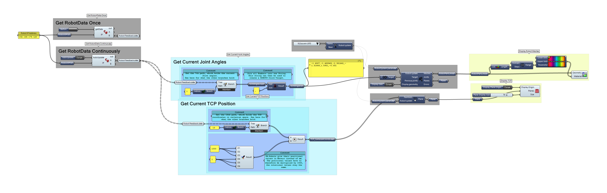

# GH_Robots_URRealtimeFeedback
 Realtime Feedback from Universal Robots in Grasshopper. uses the [Robots Plugin](https://github.com/visose/Robots/).

 C# code based on [this comment.](https://github.com/visose/Robots/issues/19#issuecomment-520556168)

Demonstration Video: 
https://youtu.be/c1BiL6fXkgs 

## Grasshopper Canvas:

## Usage: 
- [Download the folder](https://github.com/robin-gdwl/GH_Robots_URRealtimeFeedback/archive/main.zip)
- Unblock the zip file 
- open .ghx file in Grasshopper 

Tested with Rhino 6 on Windows. 
On opening the Grasshopper definition you may be prompted to specify the location of the **Robots.DLL** file. It is located in your grasshopper Library driectory (where you install plugins)

There may be an issue with the C# script consuming uneccesary amounts of RAM. I hope to fix this soon. 

# TODO:
- Test on mac 
- Investigate Memory Leak
- Annotate GH Definition 
- Comment C#-script code
- make explanation Video 