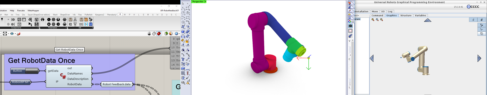
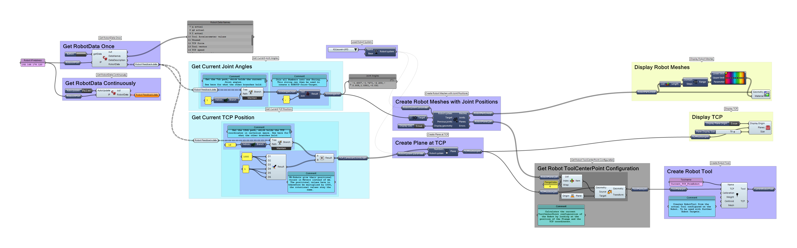

# GH_Robots_URRealtimeFeedback
 Realtime Feedback from Universal Robots in Grasshopper. uses the [Robots Plugin](https://github.com/visose/Robots/). **Use at your own Risk. 
 See Below for Usage-Instructions. 
 
 Contains 2 C# scripts: 

 **GetURDataContinuosly:**  
Uses a system Thread to run the Data-fetching continuously in the Background. The data is updated from the robot 1-2 times a second. I am new to threading in C# so use with caution.

**GetURDataOnce:**  
Only gets the Data when triggered by a Button but is more robust. This Component could also be used with a Grasshopper Timer but it will block the Canvas for half a second while it reconnects to the robot and fetches the data if run continuously. 

 C# code based on [this comment.](https://github.com/visose/Robots/issues/19#issuecomment-520556168)

Demonstration Video: 
https://youtu.be/c1BiL6fXkgs 

## Grasshopper Canvas:

## Usage: 
- Make sure you have the Robots Plugin installed correctly
- Download a RobotLibrary with UR Robots
- [Download the folder](https://github.com/robin-gdwl/GH_Robots_URRealtimeFeedback/archive/main.zip)
- If you use Windows: [Unblock](https://wiki.mcneel.com/rhino/unblockplugin) the .zip file 
- open the `UR-Robotfeedback01.ghx` file in Grasshopper 
- connect to the same network as a Universal Robot or a [URSIM-Software](https://www.universal-robots.com/download/?filters[]=98759&query=) Running on a virtual machine that is connected to the same Network. 
  - See [this Repository](https://github.com/a-vi-shek/URSim-Grasshopper-Link) for more information on Installing URsim and using it with grasshopper
- Set the IP adress of the Robots or the virtual machine on the network in the Panel named `Robot IP Address`

Tested with Rhino 6 on Windows. 
On opening the Grasshopper definition you may be prompted to specify the location of the **Robots.DLL** file. It is located in your Grasshopper [Library Folder](https://aws1.discourse-cdn.com/mcneel/original/3X/3/a/3a92b414f32d6b2f9038826fa0c8547087625e09.png) (where you install GH-plugins)

There may be an issue with the C# script consuming uneccesary amounts of RAM. I hope to fix this soon. 

# TODO:
- [ ] Test on mac 
- [ ] Investigate Memory Leak
- [ ] Annotate GH Definition 
- [ ] Comment C#-script code
- [ ] make explanation Video 
- [x] Add Get TCP Function 
- [x] rename functions in c#scripts 
- [ ] output the meaning of the datatree branches from the script component
  - [x] GetDataOnce
  - [ ] GetDataContinously
- [ ] put description and license into the gh file
- [ ] gh function docstrings 
- [ ] better explanations
